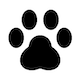
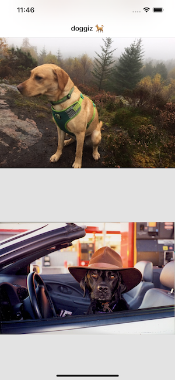

<!-- PROJECT LOGO -->
 

    
<h3 align="center">Iyashi Dog List</h3>

  

    Display a list of cute doggie images for Iyashi🐶
  

<!-- ABOUT THE PROJECT -->
## About The Project

A small app developed with the purpose of practicing the following concepts
- TDD
- SOLID principles
- UI Design Patterns(MVC, MVVM, MVP)

## Built With

[Swift](https://developer.apple.com/documentation/swift)

<!-- ACKNOWLEDGMENTS -->
## Acknowledgments

* [DOG CEO API](https://github.com/ElliottLandsborough/dog-ceo-api)
